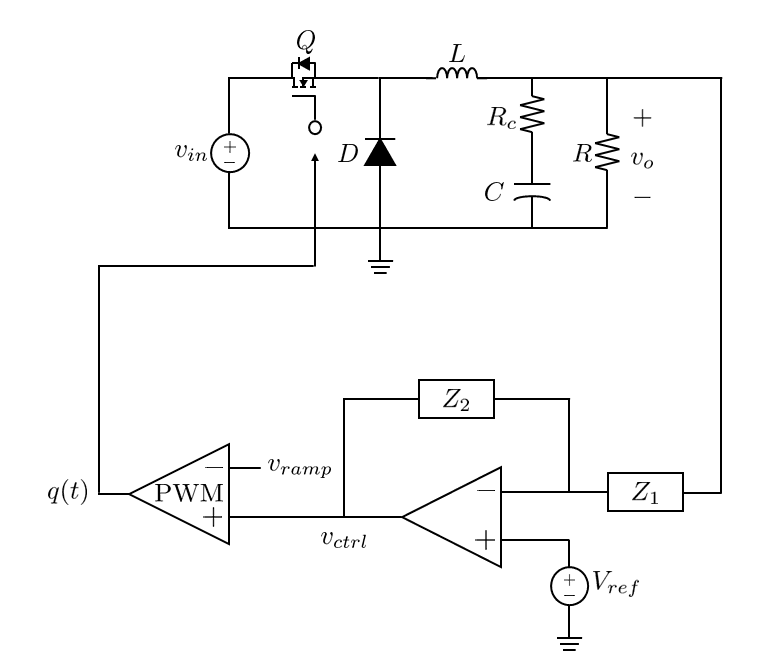
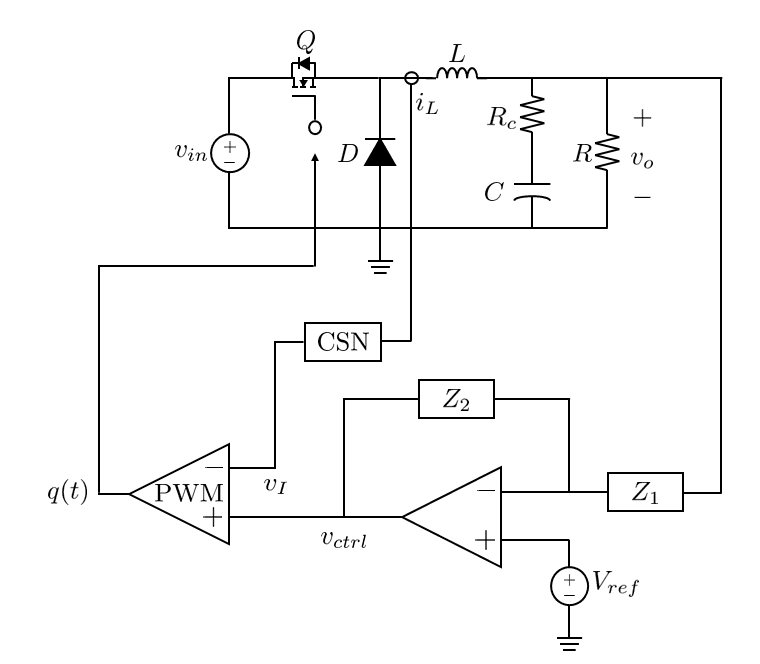
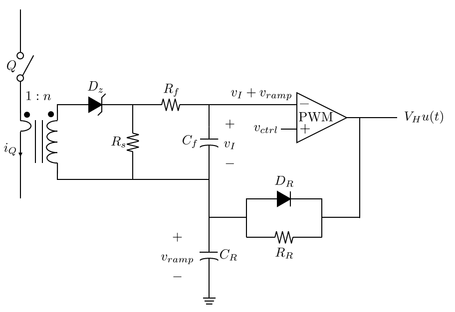

컨버터의 전류 모드 제어
=

---

## 목차
- [컨버터의 전류 모드 제어](#converter-cmc)
- [피크 전류 모드 제어](#피크-전류-모드-제어)
- [피크 전류 모드 제어기 설계](#피크-전류-모드-제어기-설계)

---

<h2 id="converter-cmc">컨버터의 전류 모드 제어</h2>

**전류 모드 제어(Current Mode Control, CMC)**는 출력 전압 및 인덕터 전류 정보를 바탕으로 피드백을 하여 출력 전압을 제어하는 기법입니다.
전류를 감지하는 방법 및 감지된 전류를 활용하는 법에는 여러 가지가 있습니다.
그 중 하나는 **피크 전류 모드 제어(Peak Current Mode Control)**입니다.
이는 인덕터 전류의 피크 값을 제어 변수로 활용하는 제어 기법입니다.
이는 주로 DC-DC 컨버터에 활용됩니다.
또 하나는 **평균 전류 모드 제어(Average Current Mode Control)**입니다.
이는 인덕터 전류의 평균 값을 제어 변수로 활용하는 제어 기법입니다.
이는 주로 역률 개선 회로에 활용됩니다.

---

## 피크 전류 모드 제어

[전압 모드 제어](./ConverterVMC.md)를 활용한 벅 컨버터는 다음과 같습니다.

<figure style="text-align: center;">
  
  <figcaption style="text-align: center; margin-top: 8px; font-size: 0.9em; color: #555;">
    (그림. 전압 모드 제어 컨버터)
  </figcaption>
</figure>

<figure style="text-align: center;">
  
  <figcaption style="text-align: center; margin-top: 8px; font-size: 0.9em; color: #555;">
    (그림. 전압 모드 제어의 PWM)
  </figcaption>
</figure>

제어 메커니즘을 다시 떠올려 봅시다.
잘 설계된 제어 회로의 경우, 정상 상태에서 $$Z_1$$의 크기가 유한하고, $$Z_2$$가 발산합니다.
이 조건 하에서 출력 전압에 변동이 생겼다고 해봅시다.
변동된 전압이 제어 회로에 음성 피드백으로 입력됩니다.
이는 제어 전압을 변동시킵니다.
제어 전압이 기준 신호보다 클 때, PWM의 출력이 $$1$$이 됩니다.
이 시간(온 타임) 동안만 스위치가 켜집니다.
온 타임, 즉 듀티 비를 조절하면서 출력 전압이 제어됩니다.

이제 피크 전류 모드 제어를 활용한 벅 컨버터를 살펴봅시다.

<figure style="text-align: center;">
  
  <figcaption style="text-align: center; margin-top: 8px; font-size: 0.9em; color: #555;">
    (그림. 피크 전류 모드 제어 컨버터)
  </figcaption>
</figure>

<figure style="text-align: center;">
  
  <figcaption style="text-align: center; margin-top: 8px; font-size: 0.9em; color: #555;">
    (그림. 피크 전류 모드 제어의 PWM)
  </figcaption>
</figure>

전압 모드 제어 회로에 인덕터 전류 감지 회로가 추가되었고, 이 신호가 PWM 비교기의 $$(-)$$단자에 연결되었습니다.
기존의 PWM의 기준 신호로 톱니파가 활용되었습니다.
톱니파가 아니더라도 동일한 결과를 얻을 수 있는 선형적인 신호는 모두 활용이 가능합니다.
대표적으로 삼각파가 있습니다.
삼각파도 PWM의 기준 신호로 많이 활용됩니다.
그리고 이 삼각파는 인덕터 전류로부터 추출할 수 있습니다.
인덕터 전류가 삼각파이기 때문입니다.
그래서 PWM의 기준 신호로 인덕터 전류 정보를 활용하는 것이 전류 모드 제어의 기본적인 아이디어입니다.

피크 전류 모드 제어에서의 제어 메커니즘을 설명하겠습니다.
전압 모드 제어의 경우, 제어 전압이 기준 신호보다 큰 경우에만 PWM의 출력이 $$1$$이었습니다.
하지만 이제는 인덕터 전류를 기준 신호로 활용합니다.
인덕터 전류는 인덕터 전압이 양의 상수인 경우에 선형적으로 증가하고, 음의 상수인 경우에 선형적으로 감소합니다.
인덕터 전압이 양수라는 것은 스위치가 켜져서 인덕터에 입력 전압과 출력 전압의 차만큼 걸린다는 의미입니다.
즉, 스위치가 켜진 시간입니다.
인덕터 전압이 음수라는 것은 스위치가 꺼져서 인덕터에 출력 전압이 극성이 반대가 되어 걸린다는 의미입니다.
즉, 스위치가 꺼진 시간입니다.
따라서 인덕터 전류가 최대가 되는 시각에 스위치를 끄면 됩니다.
이는 제어 전압과 인덕터 전류의 피크 값을 동일하게 설정하면 됩니다.
하지만 두 양은 차원이 다릅니다.
따라서 전류 감지 회로를 통해 전류 정보를 전압 차원으로 바꿔야 합니다.
그리고 피크 전류 모드 제어의 PWM 블록에는 스위치를 키기 위한 추가적인 클럭 신호가 필요합니다.
클럭 신호가 $$1$$일 때 스위치가 켜지고, 인덕터 전류가 피크 값이 될 때 스위치가 꺼집니다.
따라서 피크 전류 모드 제어의 PWM 출력 신호는 다음과 같습니다.

$$
q(t)=\begin{cases}
	1\ \ \ \text{(CLK on)}\\
	0\ \ \ \left(i_L(t)=i_{L,peak}\right)
\end{cases}
$$

### 저조파 진동

인덕터 전류의 피크 값을 감지하여 제어하는 방법은 아이디어가 좋았으나, 치명적인 문제가 있습니다.
외란에 의해 피드백 신호가 변하는 경우에 문제가 발생합니다.
우선 다음의 두 경우에 대해 살펴봅시다.
먼저 듀티 비가 $$0.5$$보다 작은 경우입니다.

<figure style="text-align: center;">
  
  <figcaption style="text-align: center; margin-top: 8px; font-size: 0.9em; color: #555;">
    (그림. \(D<0.5\)일 때의 외란 파형)
  </figcaption>
</figure>

실선은 원래의 전류 피드백 신호이고, 점선은 외란에 의해 변화된 피드백 신호입니다.
두 신호는 이전에 언급한 PWM 메커니즘에 따라 클럭 신호가 입력될 때 증가하고, 피크 값에 도달할 때, 감소합니다.
이에 따라 두 신호를 그려보면 간격이 줄어들면서 결국 격차가 사라집니다.
즉, 컨버터가 안정된 상태입니다.
하지만 듀티 비가 $$0.5$$보다 큰 경우는 달라집니다.

<figure style="text-align: center;">
  
  <figcaption style="text-align: center; margin-top: 8px; font-size: 0.9em; color: #555;">
    (그림. \(D>0.5\)일 때의 외란 파형)
  </figcaption>
</figure>

두 신호를 그려보면 시간이 지날 수록 간격이 더 벌어집니다.
오차가 점점 커진다는 의미이고, 이로 인해 컨버터가 불안정해집니다.
이러한 현상을 **저조파 진동(Subharmonic Oscillation)**이라고 합니다.

### 보상 신호

앞서 언급한 저조파 진동으로 인해 듀티 비가 $$0.5$$보다 큰 경우에는 피크 전류 모드 제어를 이용한 컨버터가 불안정해집니다.
그렇다고 듀티 비를 항상 $$0.5$$보다 작게 설정하여 사용할 수는 없습니다.
따라서 이를 해결할 방법이 필요합니다.
방법은 어렵지 않습니다.
전압 모드 제어에서 사용한 기준 신호를 다시 이용하는 것입니다.
전류 피드백 신호와 기준 신호(톱니파)를 더하면 파형이 다음과 같습니다.

<figure style="text-align: center;">
  
  <figcaption style="text-align: center; margin-top: 8px; font-size: 0.9em; color: #555;">
    (그림. 보상 신호를 이용한 제어)
  </figcaption>
</figure>

이제 제어 메커니즘이 약간 바뀌었습니다.
스위치가 켜지는 타이밍은 이전과 동일하게 클럭 신호를 따릅니다.
하지만 스위치가 꺼지는 타이밍은 이전과 달리 전류 피드백 신호와 제어 전압이 같아질 때가 아닌, 전류 피드백 신호와 기준 신호의 합이 제어 전압과 같아질 때입니다.

$$
q(t)=\begin{cases}
	1\ \ \ \text{(CLK on)}\\
	0\ \ \ \left(v_I(t)+v_{ramp}(t)=v_{ctrl}(t)\right)
\end{cases}
$$

듀티 비를 $$0.5$$보다 크게 설정한 뒤 전류 피드백 신호에 외란을 가하면 다음과 같이 나타납니다.

<figure style="text-align: center;">
  
  <figcaption style="text-align: center; margin-top: 8px; font-size: 0.9em; color: #555;">
    (그림. 보상 신호가 적용된 외란 파형)
  </figcaption>
</figure>

두 신호를 그려보면 이전과는 달리 간격이 점점 줄어듭니다.
클럭 신호가 입력될 때마다 피드백 신호가 초기화되기 때문입니다.
이 컨버터는 안정된 상태입니다.
이러한 기준 신호를 **보상 신호(Compensation Ramp)**라고 합니다.
보상 신호를 더해줌으로써 컨버터는 듀티 비 범위 $$0<D<1$$ 내에서 안정적으로 동작합니다.

저조파 진동으로 인해 기준 신호를 외부가 아닌 회로 내부의 변수를 이용하려는 목적은 결국 달성하지 못했습니다.
비록 피크 전류 모드 제어가 외부 기준 신호를 필요로 하지만 이에 비해 가지는 이점이 많습니다.
이는 이후에 언급하겠습니다.

### 보상 신호의 정량적 설계

앞서 살펴본 보상 신호는 전류 피드백 신호에 더해지는 형태였습니다.
이와 동등한 효과를 나타내는 다른 방법이 있습니다.
바로 제어 전압에서 보상 신호를 빼는 형태입니다.

<figure style="text-align: center;">
  
  <figcaption style="text-align: center; margin-top: 8px; font-size: 0.9em; color: #555;">
    (그림. 보상 신호 모델의 등가 모델)
  </figcaption>
</figure>

$$
q(t)=\begin{cases}
	1\ \ \ \text{(CLK on)}\\
	0\ \ \ \left(v_I(t)=v_{ctrl}(t)-v_{ramp}(t)\right)
\end{cases}
$$

인덕터 전류의 피크 값이 제어 전압과 보상 신호의 차와 같아지는 순간 스위치가 꺼지고, 클럭 신호가 입력될 때 스위치가 다시 켜집니다.
이러한 형태가 인덕터 전류에 외란이 가해졌을 때 더 분석하기 쉬우므로 이를 이용해서 분석해봅시다.
다음과 같이 인덕터 전류에 외란이 가해진 경우를 생각해봅시다.

<figure style="text-align: center;">
  
  <figcaption style="text-align: center; margin-top: 8px; font-size: 0.9em; color: #555;">
    (그림. 외란 분석 1)
  </figcaption>
</figure>

$$k$$번째 전류 피드백 신호 오차는 $$\Delta v_{I,k}$$이고, 두 신호가 $$v_{ctrl}-v_{ramp}$$와 같아지는 시각은 $$T_s\Delta d$$만큼 차이납니다.
$$S_n$$은 인덕터 전류가 상승하는 구간에서의 전류 피드백 신호의 기울기, $$S_e$$는 보상 신호의 기울기, 그리고 $$S_f$$는 인덕터 전류가 하강하는 구간에서의 전류 피드백 신호의 기울기입니다.
이 기울기들은 모두 절댓값을 나타냅니다.

<figure style="text-align: center;">
  
  <figcaption style="text-align: center; margin-top: 8px; font-size: 0.9em; color: #555;">
    (그림. 외란 분석 2)
  </figcaption>
</figure>

이 변수들을 이용하면 $$k$$번째 전류 피드백 신호 오차는 다음과 같습니다.

$$
\Delta v_{I,k}=S_nT_s\Delta d+S_eT_s\Delta d
$$

이제 인덕터 전류가 피크 값에 도달한 이후를 살펴봅시다.
인덕터 전류가 줄어들다가 클럭 신호가 입력이 되어 다시 상승합니다.
그리고 피크 값에 도달하기 전까지는 오차가 일정합니다.
$$k+1$$번째의 전류 피드백 신호 오차는 다음과 같습니다.

$$
\Delta v_{I,k+1}=S_fT_s\Delta d-S_eT_s\Delta d
$$

컨버터가 안정적으로 동작하기 위해서는 오차가 줄어야 합니다.
따라서 다음과 같이 나타낼 수 있습니다.

$$
\begin{align*}
	&\Delta v_{I,k+1}<\Delta v_{I,k}\\
	&\rightarrow S_fT_s\Delta d-S_eT_s\Delta d<S_nT_s\Delta d+S_eT_s\Delta d
\end{align*}
$$

따라서 안정 동작을 보장하는 보상 신호의 기울기 조건은 다음과 같습니다.

$$
S_e>\frac{S_f-S_n}{2}
$$

만약 보상 신호가 없는 경우는 다음 조건 하에서 컨버터가 안정적으로 동작합니다.

$$
\begin{align*}
	&S_e=0\\
	&\rightarrow S_n>S_f
\end{align*}
$$

인덕터 전류 상승 구간에서의 기울기가 하강 구간에서의 기울기가 크다는 것은 듀티 비가 $$0.5$$보다 낮은 상태를 의미합니다.
이는 보상 신호 도입 전에 살펴본 바와 같습니다.

### 스위치 전류 감지

피크 전류 모드 제어에서는 인덕터 전류 대신 스위치 전류를 활용할 수도 있습니다.
벅 컨버터의 경우, 스위치가 켜진 상태에서는 스위치 전류와 인덕터 전류가 같고, 스위치가 꺼진 상태에서는 스위치 전류가 $$0$$이고, 인덕터 전류는 감소합니다.
필요한 정보는 인덕터 전류가 피크 값이 되는 시점이므로 스위치 전류를 이용할 수도 있습니다.

<figure style="text-align: center;">
  
  <figcaption style="text-align: center; margin-top: 8px; font-size: 0.9em; color: #555;">
    (그림. 스위치 전류 감지 회로)
  </figcaption>
</figure>

<figure style="text-align: center;">
  
  <figcaption style="text-align: center; margin-top: 8px; font-size: 0.9em; color: #555;">
    (그림. 스위치 전류 감지 회로 파형)
  </figcaption>
</figure>

그림과 같이 스위치가 꺼지고 켜지는 타이밍이 인덕터 전류를 감지한 경우와 같음을 알 수 있습니다.
스위치 전류를 활용한 경우는 다음과 같은 이점들이 있습니다.

- 전류 감지 회로의 간소화
- 스위치 전류의 DC 값과 AC 값 감지
- 스위치 전류의 과전류 보호

이러한 이점들로 인해 스위치 전류를 이용한 피크 전류 모드 제어는 컨버터에 널리 이용되고 있습니다.

### 전류 감지 회로

<figure style="text-align: center;">
  
  <figcaption style="text-align: center; margin-top: 8px; font-size: 0.9em; color: #555;">
    (그림. 전류 감지 회로)
  </figcaption>
</figure>

이제 전류 감지 회로가 어떻게 구성되어 있는지 살펴봅시다.
우선 스위치가 켜진 경우, 스위치 전류를 턴 비가 $$1:n$$인 변류기를 이용하여 감지 회로로 흐르게 합니다.
이 전류는 제너 다이오드 $$D_z$$를 따라 감지 저항 $$R_s$$에서 전압 정보로 변환되고, 저항 $$R_f$$와 축전기 $$C_f$$로 구성된 저역 필터를 통과하여 전류 피드백 신호 $$v_I$$로 변환됩니다.
보상 신호의 경우는 클럭 신호가 입력이 되면 저항 $$R_R$$을 지나 축전기 $$C_R$$을 충전시키고, 축전기 양단의 전압을 이용하여 구성됩니다.
스위치가 꺼진 경우에는 $$D_z$$에 의해 변류기가 리셋됩니다.

먼저 전류 피드백 신호의 식을 구해봅시다.
이 회로는 다음과 같이 모델링할 수 있습니다.

<figure style="text-align: center;">
  
  <figcaption style="text-align: center; margin-top: 8px; font-size: 0.9em; color: #555;">
    (그림. 전류 피드백 회로의 등가 모델)
  </figcaption>
</figure>

이때 $$C_f$$에 걸리는 전압은 다음과 같습니다.

$$
v_I(s)=\frac{1}{sC_f}\frac{R_s}{R_s+R_f+\displaystyle\frac{1}{sC_f}}\frac{i_Q(s)}{n}
$$

따라서 전류 감지 회로의 전류-전압 변환 이득은 다음과 같습니다.

$$
\begin{align*}
	R_i(s)&=\frac{v_I(s)}{i_Q(s)}\\
	&=\frac{1}{sC_f}\frac{R_s}{R_s+R_f+\displaystyle\frac{1}{sC_f}}\frac{1}{n}\\
	&=\frac{R_s}{n}\frac{1}{1+sC_f\left(R_s+R_f\right)}
\end{align*}
$$

제어 대역에서는 다음과 같이 근사할 수 있습니다.

$$
R_i=\frac{R_s}{n}
$$

다음으로 보상 신호의 식을 구해봅시다.
이 회로는 다음과 같이 모델링할 수 있습니다.

<figure style="text-align: center;">
  
  <figcaption style="text-align: center; margin-top: 8px; font-size: 0.9em; color: #555;">
    (그림. 보상 신호 회로의 등가 모델)
  </figcaption>
</figure>

클럭 신호가 계단 함수 형태로 입력되므로 보상 신호는 다음과 같습니다.

$$
v_{ramp}(s)=\frac{\displaystyle\frac{1}{sC_R}}{R_R+\displaystyle\frac{1}{sC_R}}\frac{V_{CLK}}{s}
$$

라플라스 역변환을 통해 다음과 같이 나타낼 수 있습니다.

$$
v_{ramp}(t)=V_{CLK}\left(1-e^{-\frac{t}{R_RC_R}}\right)
$$

이는 다음의 가정 하에 근사가 가능합니다.

$$
\begin{align*}
	&T_s\ll R_RC_R\\
	&\rightarrow v_{ramp}(t)=\left(1-\left(1-\frac{V_{CLK}}{R_RC_R}t\right)\right)=\frac{V_{CLK}}{R_RC_R}t
\end{align*}
$$

보상 신호의 기울기가 다음과 같음을 알 수 있습니다.

$$
S_e=\frac{V_{CLK}}{R_RC_R}
$$

보상 신호의 진폭은 다음과 같습니다.

$$
\begin{align*}
	V_m&=v_{ramp}(T_s)\\
	&=\frac{V_{CLK}}{R_RC_R}T_s
\end{align*}
$$

### 피크 전류 모드 제어의 장점

- 동적 성능 개선: 부스트 컨버터와 벅-부스트 컨버터는 우반면 영점으로 인해 전압 모드 제어만으로는 제어가 어려웠습니다. 이는 전류 모드 제어를 통해 안정성과 성능을 확보할 수 있습니다.
- 컨버터 동 특성의 민감도 감소: 전류 모드 제어로 동작하는 컨버터는 전압 모드 제어로 동작하는 컨버터에 비해 전원 임피던스와 동작 모드 전환(CCM, DCM)에 의한 영향을 덜 받습니다. (참고: [논문 1](https://ieeexplore.ieee.org/document/4118289), [논문 2](https://ieeexplore.ieee.org/document/1582007), [논문 3](https://ieeexplore.ieee.org/document/124586))
- 보상기 설계의 간소화: 3P2Z 보상기를 필요로 하는 전압 모드 제어 컨버터와는 달리 전류 모드 제어 컨버터는 2P1Z 보상기를 필요로 합니다.

### 피크 전류 모드 제어의 단점
- 다중 루프 분석: 인덕터 전류 정보를 추출하는 새 루프로 인해 시스템 분석이 비교적 복잡합니다.
- 샘플링 효과: 컨버터의 제어 회로의 업데이트 주기는 스위칭 주기와 같습니다. 이는 이산적인 시스템이라고 볼 수 있고, 분석하고자 하는 주파수가 스위칭 주파수의 절반에 가까워질 수록 오차가 커지면서 위상이 떨어집니다.

---

## 피크 전류 모드 제어기 설계

앞서 언급했듯이 샘플링 효과로 인해 피크 전류 모드 제어기는 이산적인 시스템입니다.
따라서 $$z$$ 영역에서 해석하는 게 맞습니다.
하지만 샘플링 효과가 컨버터 동 특성에 영향을 거의 미치지 않는다고 가정하면 주파수 영역에서 해석할 수 있습니다.

### 피크 전류 모드 제어기의 소신호 모델

우선 피크 전류 모드 제어를 활용한 벅 컨버터는 다음과 같습니다.

<figure style="text-align: center;">
  
  <figcaption style="text-align: center; margin-top: 8px; font-size: 0.9em; color: #555;">
    (그림. 피크 전류 모드 제어 벅 컨버터)
  </figcaption>
</figure>

이를 소신호 모델로 나타내면 다음과 같습니다.

<figure style="text-align: center;">
  
  <figcaption style="text-align: center; margin-top: 8px; font-size: 0.9em; color: #555;">
    (그림. 피크 전류 모드 제어 벅 컨버터의 소신호 모델)
  </figcaption>
</figure>

스위칭 모델은 스위치 전류 정보를 이용하지만, 소신호 모델의 경우는 인덕터 전류 정보를 이용합니다.
피크 전류 모드 제어에서는 두 전류가 기능적으로 같기 때문에 무방합니다.

먼저 전압 피드백 보상기는 다음과 같습니다.

$$
	F_v(s)=\frac{Z_2(s)}{Z_1(s)}
$$

그리고 전류 감지 회로의 이득은 다음과 같습니다.

$$
R_i=\frac{R_s}{n}
$$

이제 PWM 이득을 구해봅시다.
인덕터 전류에 약간의 외란이 발생했다고 해봅시다.

<figure style="text-align: center;">
  
  <figcaption style="text-align: center; margin-top: 8px; font-size: 0.9em; color: #555;">
    (그림. 전류 외란 파형)
  </figcaption>
</figure>

스위치가 켜져 있을 때와 꺼져 있을 때의 각각의 전류 피드백 신호의 평균 값은 다음과 같습니다.

$$
\begin{cases}
			\overline{v}_{I,on}=v_{ctrl}-S_eT_sd-\displaystyle\frac{1}{2}S_nT_sd\\
			\overline{v}_{I,off}=v_{ctrl}-S_eT_sd-\displaystyle\frac{1}{2}S_fT_s\left(1-d\right)
		\end{cases}
$$

외란이 매우 작다는 가정 하에 다음과 같이 근사할 수 있습니다.

$$
\overline{v}_{I,on}\approx\overline{v}_{I,off}
$$

정리하면 다음과 같습니다.

$$
	\begin{align*}
			&v_{ctrl}-S_eT_sd-\displaystyle\frac{1}{2}S_nT_sd=v_{ctrl}-S_eT_sd-\displaystyle\frac{1}{2}S_fT_s\left(1-d\right)\\
			&\rightarrow \left(S_n+S_f\right)d=S_f
	\end{align*}
$$

그리고 이러한 가정 하에 두 전류 피드백 신호의 평균 값은 전체의 평균으로 근사할 수 있습니다.

$$
\overline{v}_{I,on}\approx\overline{v}_{I,off}\approx\overline{v}_I
$$

따라서 오프 타임에서의 전류 피드백 신호의 평균 값은 다음과 같이 쓸 수 있습니다..

$$
	\begin{align*}
\overline{v}_{I,off}&=\overline{v}_I\\
&=v_{ctrl}-S_eT_sd-\displaystyle\frac{1}{2}S_fT_s\left(1-d\right)\\
&=v_{ctrl}-S_eT_sd-\displaystyle\frac{1}{2}\left(S_n+S_f\right)T_sd\left(1-d\right)
	\end{align*}
$$

이제 선형화를 해봅시다.
각 변수를 다음과 같이 쓸 수 있습니다.

$$
\begin{cases}
	\overline{v}_I=V_I+\hat{v}_I\\
	v_{ctrl}=V_{ctrl}+\hat{v}_{ctrl}\\
	d=D+\hat{d}
\end{cases}
$$

대입하면 다음과 같습니다.

$$
V_I+\hat{v}_I=\left(V_{ctrl}+\hat{v}_{ctrl}\right)-S_eT_s\left(D+\hat{d}\right)-\displaystyle\frac{1}{2}\left(S_n+S_f\right)T_s\left(D+\hat{d}\right)\left(1-\left(D+\hat{d}\right)\right)
$$

소신호 항만 정리하면 다음과 같습니다.

$$
\hat{v}_I=\hat{v}_{ctrl}-\left(S_e+\frac{1}{2}\left(S_n+S_f\right)\left(1-2D\right)\right)T_s\hat{d}
$$

정상 상태에서 이전에 구한 기울기 관계식은 다음과 같이 나타납니다.

$$
\left(S_n+S_f\right)D=S_f
$$

따라서 소신호 표현식은 다음과 같습니다.

$$
\hat{v}_I=\hat{v}_{ctrl}-\left(S_e+\frac{1}{2}\left(S_n-S_f\right)\right)T_s\hat{d}
$$

PWM 이득은 다음과 같이 정의됩니다.

$$
F_m'=\frac{\hat{d}}{\hat{v}_{ctrl}-\hat{v}_I}
$$

대입하면 다음과 같습니다.

$$
	\begin{align*}
&\frac{\hat{d}}{\hat{v}_{ctrl}-\hat{v}_I}=\frac{1}{\left(S_e+\displaystyle\frac{1}{2}\left(S_n-S_f\right)\right)T_s}=\frac{2}{\left(S_n-S_f+2S_e\right)T_s}\\
&\rightarrow F_m'=\frac{2}{\left(S_n-S_f+2S_e\right)T_s}
\end{align*}
$$

이 PWM 이득 식은 저조파 진동 또한 잘 예측합니다.
저조파 진동을 없애기 위해 보상 신호를 도입한 것이므로 보상 신호를 없애봅시다.

$$
S_e=0
$$

이때 PWM 이득은 다음과 같습니다.

$$
F_m'=\frac{2}{\left(S_n-S_f\right)T_s}
$$

듀티 비 $$0.5$$를 기준으로 세 경우에 대해 다음과 같이 쓸 수 있습니다.

<figure style="text-align: center;">
  
  <figcaption style="text-align: center; margin-top: 8px; font-size: 0.9em; color: #555;">
    (그림. 듀티 비에 따른 외란 파형)
  </figcaption>
</figure>

$$
\begin{cases}
	D<0.5\leftrightarrow S_n>S_f\leftrightarrow F_m'>0\leftrightarrow\text{(안정)}\\
	D=0.5\leftrightarrow S_n=S_f\leftrightarrow F_m'\rightarrow\infty\leftrightarrow\text{(불안정)}\\
	D>0.5\leftrightarrow S_n<S_f\leftrightarrow F_m'<0\leftrightarrow\text{(불안정)}
\end{cases}
$$

즉, 듀티 비가 $$0.5$$ 미만일 때만 안정 상태이고, 이는 PWM 이득을 통해서도 알 수 있습니다.

### 파워 스테이지의 전달 함수

피크 전류 모드 제어를 이용하는 컨버터의 블록 다이어그램 표현은 다음과 같습니다.

<figure style="text-align: center;">
  
  <figcaption style="text-align: center; margin-top: 8px; font-size: 0.9em; color: #555;">
    (그림. 피크 전류 모드 제어 컨버터의 블록 다이어그램)
  </figcaption>
</figure>

전압 모드 제어를 이용할 때에 비해 복잡합니다.
새롭게 추가된 부분의 전달 함수는 다음과 같습니다.

1. 개루프 입력-인덕터 전류 전달 함수 $$G_{is}(s)=\displaystyle\frac{\hat{i}_L(s)}{\hat{v}_{in}(s)}$$
2. 개루프 듀티 비-인덕터 전류 전달 함수 $$G_{is}(s)=\displaystyle\frac{\hat{i}_L(s)}{\hat{d}(s)}$$
3. 개루프 출력 전류-인덕터 전류 전달 함수 $$Z_q(s)=\displaystyle\frac{\hat{i}_L(s)}{\hat{i}_o(s)}$$

### 전압 피드백 루프

이제 피드백 루프를 살펴봅시다.
먼저 전압 피드백 루프는 다음과 같습니다.

$$
	\begin{align*}
		T_v(s)&=-\frac{\hat{v}_{ctrl}(s)}{\hat{v}_o(s)}\frac{\hat{d}(s)}{\hat{v}_{ctrl}(s)}\frac{\hat{v}_o(s)}{\hat{d}(s)}\\
		&=F_v(s)F_m'G_{vd}(s)
\end{align*}
$$

### 전류 피드백 루프

다음으로 전류 피드백 루프는 다음과 같습니다.

$$
	\begin{align*}
		T_i(s)&=-\frac{\hat{v}_I(s)}{\hat{i}_L(s)}\frac{\hat{d}(s)}{\hat{v}_I(s)}\frac{\hat{i}_L(s)}{\hat{d}(s)}\\
		&=R_i(s)F_m'G_{id}(s)
\end{align*}
$$

앞서 구한 식을 이용하면 다음과 같이 나타납니다.

$$
	\begin{align*}
T_i(s)&=R_iK_{id}\frac{1+\displaystyle\frac{s}{\omega_{id}}}{1+\displaystyle\frac{s}{Q\omega_0}+\displaystyle\frac{s^2}{\omega_0^2}}\frac{2}{\left(S_n-S_f+2S_e\right)T_s}\\
&=K_i\frac{1+\displaystyle\frac{s}{\omega_{id}}}{1+\displaystyle\frac{s}{Q\omega_0}+\displaystyle\frac{s^2}{\omega_0^2}}\ \ \ \text{where }K_i=K_{id}R_i\frac{2}{\left(S_n-S_f+2S_e\right)T_s}
\end{align*}
$$

이를 보드 선도로 나타내면 다음과 같습니다.

<figure style="text-align: center;">
  
  <figcaption style="text-align: center; margin-top: 8px; font-size: 0.9em; color: #555;">
    (그림. 전류 피드백 루프의 크기 보드 선도)
  </figcaption>
</figure>

먼저 상수인 상태에서 영점 $$\omega_{id}$$를 지나 기울기가 $$+1$$이 됩니다.
다음으로 이중 극점 $$\omega_0$$를 지나 기울기가 $$-1$$이 됩니다.
그리고 계수를 살펴보면 $$S_e$$가 분모에 위치합니다.
즉, $$S_e$$가 증가할수록 이득이 감소합니다.
이는 보상 신호의 기울기가 증가할수록 전압 모드 제어에 가까워진다는 의미입니다.

### 메이슨 법칙

루프 이득을 구하기 전에 **메이슨 법칙(Mason's Rule)**을 떠올려봅시다.
전압 모드 제어의 경우는 피드백 루프가 복잡하지 않아서 직관적으로 구할 수 있었습니다.
하지만 피크 전류 모드 제어의 경우, 피드백 루프가 비교적 복잡하여 메이슨 규칙을 이용하는 것이 좋습니다.

메이슨 법칙에 따르면 전달 함수는 다음과 같습니다.

$$
	\begin{align*}
F(s)=\frac{1}{\Delta}\displaystyle\sum_kM_k\Delta_k
\end{align*}
$$

이제 각 변수가 의미하는 바가 무엇인지 설명하겠습니다.

$$
	\begin{align*}
&\Delta:1-\text{(모든 루프의 루프 이득의 합)}+(\text{임의의 독립된 두 루프의 루프 이득의 곱의 합})-\cdots\\
&M_k:k\text{번째 경로의 이득}\\
&\Delta_k:1-(k\text{번째 경로와 독립된 모든 루프의 루프 이득의 합})+(k\text{번째 경로와 독립된 루프 중에서 서로 독립된 두 루프의 루프 이득의 곱의 합})-\cdots
\end{align*}
$$

다소 복잡한 법칙이지만 적용해보면 어렵지 않습니다.

### 전체 루프 이득

이제 메이슨 법칙을 이용해 루프 이득을 구해봅시다.
구할 루프 이득은 총 두 개입니다.
먼저 **전체 루프 이득(Overall Loop Gain)**은 다음과 같이 점 $$A$$를 기준으로 구합니다.

<figure style="text-align: center;">
  
  <figcaption style="text-align: center; margin-top: 8px; font-size: 0.9em; color: #555;">
    (그림. 전체 루프 이득)
  </figcaption>
</figure>

전체 루프 이득 $$T_1(s)$$는 다음과 같습니다.

$$
	\begin{align*}
T_1(s)=-\frac{\hat{v}_y}{\hat{v}_x}
\end{align*}
$$

메이슨 법칙으로 구하는 것은 다음의 식입니다.

$$
F(s)=\frac{\hat{v}_y}{\hat{v}_x}
$$

따라서 $$F(s)$$를 구하고 $$-1$$을 곱해주면 됩니다.
루프는 다음과 같이 나눌 수 있습니다.

<figure style="text-align: center;">
  
  <figcaption style="text-align: center; margin-top: 8px; font-size: 0.9em; color: #555;">
    (그림. 전체 루프 이득과 각 루프)
  </figcaption>
</figure>

각 변수는 다음과 같습니다.

$$
	\begin{align*}
&\Delta=1\\
&M_1=G_{id}\left(-R_i\right)F_m'=-G_{id}R_iF_m'\\
&\Delta_1=1\\
&M_2=G_{vd}\left(-F_v\right)F_m'=-G_{vd}F_vF_m'\\
&\Delta_2=1
\end{align*}
$$

따라서 전체 루프 이득은 다음과 같습니다.

$$
	\begin{align*}
T_1(s)&=-\frac{1}{\Delta}\left(M_1\Delta_1+M_2\Delta_2\right)\\
&=-\left(-G_{id}R_iF_m'-G_{vd}F_vF_m'\right)\\
&=G_{id}R_iF_m'+G_{vd}F_vF_m'\\
&=T_i(s)+T_v(s)
\end{align*}
$$

전류 피드백 루프의 루프 이득과 전압 피드백 루프의 루프 이득의 합으로 나타납니다.

### 외곽 루프 이득

다음으로 구할 루프 이득은 **외곽 루프 이득(Outer Loop Gain)**입니다.
이는 다음과 같이 점 $$B$$를 기준으로 구합니다.

<figure style="text-align: center;">
  
  <figcaption style="text-align: center; margin-top: 8px; font-size: 0.9em; color: #555;">
    (그림. 외곽 루프 이득)
  </figcaption>
</figure>

외곽 루프 이득 $$T_2(s)$$ 또한 다음과 같이 나타납니다.

$$
	\begin{align*}
T_1(s)=-\frac{\hat{v}_y'}{\hat{v}_x'}
\end{align*}
$$

이 또한 $$\displaystyle\frac{\hat{v}_y'}{\hat{v}_x'}$$를 메이슨 규칙을 이용하여 구한 뒤 $$-1$$을 곱하면 됩니다.
루프는 다음과 같이 나눌 수 있습니다.

<figure style="text-align: center;">
  
  <figcaption style="text-align: center; margin-top: 8px; font-size: 0.9em; color: #555;">
    (그림. 외곽 루프 이득과 각 루프)
  </figcaption>
</figure>

각 변수는 다음과 같습니다.

$$
	\begin{align*}
&\Delta=1-F_m'G_{vd}\left(-F_v\right)=1+F_m'G_{vd}F_v\\
&M_1=F_m'G_{vd}\left(-F_v\right)=-F_m'G_{vd}F_v\\
&\Delta_1=1
\end{align*}
$$

따라서 외곽 루프 이득은 다음과 같습니다.

$$
	\begin{align*}
T_2(s)&=-\frac{1}{\Delta}M_1\Delta_1\\
&=-\frac{-F_m'G_{vd}F_v}{1+F_m'G_{vd}F_v}\\
&=\frac{F_m'G_{vd}F_v}{1+F_m'G_{vd}F_v}\\
&=\frac{T_v(s)}{1+T_i(s)}
\end{align*}
$$

이 또한 전류 피드백 루프의 루프 이득과 전압 피드백 루프의 루프 이득으로 나타낼 수 있습니다.

### 절대 안정도

이제 피크 전류 모드 제어기의 절대 안정도를 분석해봅시다.
절대 안정도 판별을 위해 음파 민감도를 구해봅시다.

<figure style="text-align: center;">
  
  <figcaption style="text-align: center; margin-top: 8px; font-size: 0.9em; color: #555;">
    (그림. 피크 전류 모드 제어의 음파 민감도)
  </figcaption>
</figure>

각 루프는 다음과 같습니다.

<figure style="text-align: center;">
  
  <figcaption style="text-align: center; margin-top: 8px; font-size: 0.9em; color: #555;">
    (그림. 피크 전류 모드 제어의 음파 민감도와 각 루프)
  </figcaption>
</figure>

메이슨 법칙을 이용하면 음파 민감도는 다음과 같이 나타납니다.

$$
A_u(s)=\frac{\hat{v}_o}{\hat{v}_{in}}
$$

$$
	\begin{align*}
		&\Delta=1-\left(G_{vd}\left(-F_v\right)F_m'-\left(-R_i\right)F_m'G_{id}\right)=1+G_{vd}F_vF_m'+G_{id}R_iF_m'\\
		&M_1=G_{vs}\\
		&\Delta_1=1-\left(-R_i\right)F_m'G_{id}=1+G_{id}R_iF_m'\\
		&M_2=G_{is}\left(-R_i\right)F_m'G_{vd}=-G_{is}R_iF_m'G_{vd}\\
		&\Delta_2=1
\end{align*}
$$

$$
	\begin{align*}
A_u(s)&=\frac{1}{\Delta}\left(M_1\Delta_1+M_2\Delta_2\right)\\
&=\frac{G_{vs}\left(1+G_{id}R_iF_m'\right)+\left(-G_{is}R_iF_m'G_{vd}\right)}{1+G_{vd}F_vF_m'+G_{id}R_iF_m'}\\
&=\frac{G_{vs}\left(1+G_{id}R_iF_m'\right)-G_{is}R_iF_m'G_{vd}}{1+T_v(s)+T_i(s)}
\end{align*}
$$

특성 방정식은 다음과 같습니다.

$$
1+T_v(s)+T_i(s)=0
$$

이는 전체 루프 이득으로 나타낼 수 있습니다.

$$
1+T_1(s)=0
$$

이번에는 양 변을 $$1+T_i(s)$$로 나눠봅시다.

$$
1+\frac{T_v(s)}{1+T_i(s)}=0
$$

이는 외곽 루프 이득으로 나타낼 수 있습니다.

$$
1+T_2(s)=0
$$

즉, 어떤 루프 이득을 이용하여 분석하더라도 같은 정보를 얻을 수 있습니다.

<figure style="text-align: center;">
  
  <figcaption style="text-align: center; margin-top: 8px; font-size: 0.9em; color: #555;">
    (그림. 안정 상태)
  </figcaption>
</figure>

<figure style="text-align: center;">
  
  <figcaption style="text-align: center; margin-top: 8px; font-size: 0.9em; color: #555;">
    (그림. 임계 안정 상태)
  </figcaption>
</figure>

<figure style="text-align: center;">
  
  <figcaption style="text-align: center; margin-top: 8px; font-size: 0.9em; color: #555;">
    (그림. 불안정 상태)
  </figcaption>
</figure>

### 상대 안정도

다음으로 상대 안정도를 살펴봅시다.
각 루프 이득은 다음과 같이 쓸 수 있습니다.

$$
	\begin{align*}
&T_1(j\omega)=\left\vert T_i(j\omega)+T_v(j\omega)\right\vert\angle\left( T_i(j\omega)+T_v(j\omega)\right)\\
&T_2(j\omega)=\left\vert\frac{T_v(j\omega)}{1+T_i(j\omega)}\right\vert\angle\left(\frac{T_v(j\omega)}{1+T_i(j\omega)}\right)
\end{align*}
$$

이득 여유는 각 루프 이득의 크기를 컨버터가 불안정해질 때까지 얼마나 늘릴 수 있는지를 의미합니다.
위상 여유는 각 루프 이득의 위상을 컨버터가 불안정해질 때까지 얼마나 줄일 수 있는지(지연시킬 수 있는지)를 의미합니다.

### 단일 적분 보상기의 문제점

보상기를 설계하기 위해 먼저 전류 피드백 루프와 전압 피드백 루프를 살펴봅시다.
전류 피드백 루프는 다음과 같습니다.

$$
T_i(s)=\frac{V_{in}}{R}\frac{1+\displaystyle\frac{s}{\omega_{id}}}{1+\displaystyle\frac{s}{Q\omega_0}+\displaystyle\frac{s^2}{\omega_0^2}}R_iF_m'
$$

전류 피드백 루프는 $$G_{id}$$의 극점과 영점의 위치에 의해 결정되는 것을 알 수 있습니다.
다음으로 전압 피드백 루프는 다음과 같습니다.

$$
T_v(s)=F_vF_m'V_{in}\frac{1+\displaystyle\frac{s}{\omega_{esr}}}{1+\displaystyle\frac{s}{Q\omega_0}+\displaystyle\frac{s^2}{\omega_0^2}}
$$

전압 피드백 루프의 경우, 전류 피드백 루프와는 다르게 보상기로부터 영향을 받습니다.
단일 적분기를 통해 전체 루프 이득을 설계해봅시다.

$$
T_1(s)=T_i(s)+T_v(s)=\begin{cases}
	T_i(s)\ \ \ \text{for }\left\vert T_i\right\vert\gg\left\vert T_v\right\vert\\
	T_v(s)\ \ \ \text{for }\left\vert T_i\right\vert\ll\left\vert T_v\right\vert
\end{cases}
$$

두 피드백 루프의 보드 선도는 다음과 같이 나타납니다.

<figure style="text-align: center;">
  
  <figcaption style="text-align: center; margin-top: 8px; font-size: 0.9em; color: #555;">
    (그림. 전체 루프 이득의 크기 보드 선도)
  </figcaption>
</figure>

언뜻 보면 별 문제가 없어보입니다.
하지만 위상 선도를 보면 문제점이 보입니다.

<figure style="text-align: center;">
  
  <figcaption style="text-align: center; margin-top: 8px; font-size: 0.9em; color: #555;">
    (그림. 전체 루프 이득의 위상 보드 선도)
  </figcaption>
</figure>

두 피드백 루프가 교차하는 지점에서 두 피드백 루프의 위상이 $$180^{\circ}$$만큼 차이가 납니다.
교차 지점이므로 크기는 같습니다.
크기는 같고 방향은 반대이므로 이 지점에서 전달 함수의 크기는 $$0$$이 됩니다.
그러므로 다음과 같이 보드 선도에서는 $$-\infty$$로 발산합니다.

<figure style="text-align: center;">
  
  <figcaption style="text-align: center; margin-top: 8px; font-size: 0.9em; color: #555;">
    (그림. 전체 루프 이득의 크기 보드 선도)
  </figcaption>
</figure>

이런 문제로 인해 컨버터가 불안정해집니다.

### 2P1Z 보상기를 이용해 설계한 전체 루프 이득

이러한 문제점을 없애기 위해 새로운 형태의 보상기가 필요합니다.
핵심은 두 피드백 루프가 교차하는 지점에서 위상차가 $$180^{\circ}$$가 되지 않게 방지하는 것입니다.
단일 적분기는 위상이 $$-90^{\circ}$$이고, 이후에 이중 극점을 지나면서 위상이 $$-270^{\circ}$$까지 떨어집니다.
루프 이득이 단일 적분기의 형태가 되도록 단일 적분항은 유지하나, 위상이 급격하게 떨어지지 않도록 이중 극점 근처에 영점을 위치시켜 위상을 보충하는 방법이 있습니다.
전압 모드 제어에서 적용한 방법과 동일하게 이중 극점보다 낮은 주파수에 위치시켜야 합니다.
이중 극점보다 높은 주파수에 위치시키면 조건 안정 상태가 되고 위상 보충 효과가 미미해지기 때문입니다.
이를 통해 두 피드백 루프는 교차점에서 위상차가 약 $$90^{\circ}$$가 되고, 두 피드백 루프의 합의 크기가 이전과 같이 급격하게 작아지는 것을 방지할 수 있습니다.
이후에 esr 영점의 영향을 상쇄하도록 동일한 위치에 극점을 위치시키면 됩니다.
이 보상기는 극점이 두 개이고, 영점이 한 개이므로 **2P1Z 보상기(2-Pole-1-Zero Compensator)**라고 합니다.
2P1Z 보상기는 다음의 형태로 나타납니다.

$$
F_v(s)=\frac{K_v}{s}\frac{1+\displaystyle\frac{s}{\omega_{zc}}}{1+\displaystyle\frac{s}{\omega_{pc}}}
$$

전압 피드백 루프는 다음과 같습니다.

$$
\begin{align*}
T_v(s)&=F_v(s)F_m'G_{vd}\\
&=\frac{K_v}{s}\frac{1+\displaystyle\frac{s}{\omega_{zc}}}{1+\displaystyle\frac{s}{\omega_{pc}}}F_m'V_s\frac{1+\displaystyle\frac{s}{\omega_{esr}}}{1+\displaystyle\frac{s}{Q\omega_0}+\displaystyle\frac{s^2}{\omega_0^2}}\\
&=\frac{K_1}{s}\frac{1+\displaystyle\frac{s}{\omega_{zc}}}{1+\displaystyle\frac{s}{Q\omega_0}+\displaystyle\frac{s^2}{\omega_0^2}}\ \ \ \text{where }K_1=K_vF_m'V_s
\end{align*}
$$

전체 루프 이득은 다음과 같이 나타낼 수 있습니다.

$$
T_1(s)=\frac{K_1}{s}\frac{\left(1+\displaystyle\frac{s}{\omega_{zc}}\right)\left(1+\displaystyle\frac{s}{\omega_{cr}}\right)}{1+\displaystyle\frac{s}{Q\omega_0}+\displaystyle\frac{s^2}{\omega_0^2}}
$$

<figure style="text-align: center;">
  
  <figcaption style="text-align: center; margin-top: 8px; font-size: 0.9em; color: #555;">
    (그림. 2P1Z 보상기를 이용한 전체 루프 이득의 크기 보드 선도)
  </figcaption>
</figure>

<figure style="text-align: center;">
  
  <figcaption style="text-align: center; margin-top: 8px; font-size: 0.9em; color: #555;">
    (그림. 2P1Z 보상기를 이용한 전체 루프 이득의 위상 보드 선도)
  </figcaption>
</figure>

저주파 대역에서는 전압 피드백 루프의 크기가 전류 피드백 루프에 비해 지배적으로 나타납니다.
고주파 대역에서는 전류 피드백 루프의 크기가 더 지배적입니다.
따라서 고주파 대역에서 전류 피드백 루프의 $$-20\text{ dB/dec}$$의 기울기와 위상 $$-90^{\circ}$$인 특성이 전체 루프 이득에 그대로 반영되므로 안정성이 보장됩니다.
또한 전류 피드백 루프의 교차 주파수와 위상 여유가 전체 루프 이득에 반영됩니다.

### 2P1Z 보상기를 이용해 설계한 외곽 루프 이득

외곽 루프 이득은 다음과 같이 나타낼 수 있습니다.

$$
T_2(s)=\frac{T_v(s)}{1+T_i(s)}=\begin{cases}
	\displaystyle\frac{T_v(s)}{T_i(s)}\ \ \ \text{for }\left\vert T_i\right\vert\gg1\\
	T_v(s)\ \ \ \text{for }\left\vert T_i\right\vert\ll1
	\end{cases}
$$

앞서 구한 2P1Z 보상기를 이용하여 점근적 분석을 통해 구한 외곽 루프 이득은 다음과 같습니다.

<figure style="text-align: center;">
  
  <figcaption style="text-align: center; margin-top: 8px; font-size: 0.9em; color: #555;">
    (그림. 2P1Z 보상기를 이용한 전체 루프 이득의 크기 보드 선도)
  </figcaption>
</figure>

$$

$$
