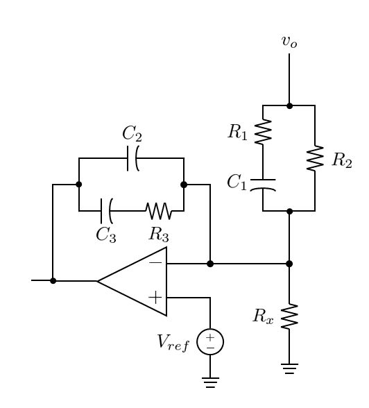

컨버터의 전압 모드 제어
=

---

## 목차

---

## 컨버터의 전압 모드 제어

**전압 모드 제어(Voltage Mode Control, VMC)**는 출력 전압의 정보를 바탕으로 피드백을 하여 출력 전압을 제어하는 기법입니다.
전압 모드 제어에 활용되는 회로는 다음과 같은 형태입니다.

(VMC)

이와 같이 출력 전압이 전압 분배기에 입력됩니다.
그리고 기준 전압과 비교하여 출력된 제어 전압이 PWM 비교기에 입력됩니다.
그리고 듀티 비가 조정되어 출력 전압이 제어되는 방식입니다.
전압 모드 제어 회로를 구체적으로 어떻게 설계해야 하는지 설명하겠습니다.

### 우반면 영점

루프 이득은 다음과 같습니다.

$$
T(s)=F_v(s)F_mG_{vd}(s)
$$

$$G_{vd}(s)$$는 파워 스테이지마다 다릅니다.
벅 컨버터는 분모가 2차식이고, 분자에는 esr 영점이 있습니다.
부스트 컨버터와 벅-부스트 컨버터는 분모가 벅 컨버터와 동일하지만 분자에 우반면 영점이 하나 더 있습니다.
우반면에 영점이 있는 경우는 전압 모드 제어로 제어할 수 없고, 전류 정보를 추가로 이용하는 **전류 모드 제어(Current Mode Control)**를 이용해야 합니다.
따라서 벅 컨버터의 경우를 가지고 설명하겠습니다.

---

## 점근적 분석

이전에는 폐루프 컨버터의 전달 함수를 모두 구했습니다.
앞으로 분석할 전달 함수의 기본 형태는 다음과 같습니다.

$$
F(s)=\frac{G(s)}{1+T(s)}
$$

$$G(S)$$는 개루프 전달 함수이고, $$T(s)$$는 루프 이득입니다.
이제 **점근적 분석(Asymptotic Analysis)**을 통해 컨버터의 성능을 판단하고, 제어기의 설계 방향을 어떻게 정해야 하는지 설명하겠습니다.

### 근사로 인한 오차

점근적 근사는 말 그대로 근사이기 때문에 오차가 존재합니다.
오차가 어느 정도인지 예시를 들어 알아봅시다.

### 보드 선도 그리기

주어진 전달 함수 $$F(s)$$는 루프 이득의 크기에 따라 다음과 같이 쓸 수 있습니다.

$$
F(s)=\frac{G(s)}{1+T(s)}=\begin{cases}
			\frac{G(s)}{T_m(s)}\ \ \ \text{for }\left\vert T(s)\right\vert\gg1\\
			G(s)\ \ \ \text{for }\left\vert T(s)\right\vert \ll1
		\end{cases}
$$

이를 데시벨 스케일로 나타내면 다음과 같습니다.

$$
20\log\left\vert F(j\omega)\right\vert=\begin{cases}
			20\log\left\vert G(j\omega)\right\vert-20\log\left\vert T(j\omega)\right\vert\ \ \ \text{for }\left\vert T(j\omega)\right\vert\gg1\\
			20\log\left\vert G(j\omega)\right\vert\ \ \ \text{for }\left\vert T(j\omega)\right\vert \ll1
\end{cases}
$$

먼저 $$20\log\left\vert G(j\omega)\right\vert$$와 $$20\log\left\vert T(j\omega)\right\vert$$를 그립니다.

(G, T)

다음으로 $$20\log\left\vert F(j\omega)\right\vert$$를 고주파 대역부터 그려야 합니다.
교차 주파수 이상의 대역에서는 $$20\log\left\vert T(j\omega)\right\vert$$가 $$0$$이므로 $$20\log\left\vert G(j\omega)\right\vert$$와 동일합니다.

(F G)

교차 주파수에서는 $$20\log\left\vert F(j\omega)\right\vert$$와 $$20\log\left\vert G(j\omega)\right\vert$$가 만납니다.

(F G intersect)

교차 주파수 이하의 대역에서는 $$20\log\left\vert G(j\omega)\right\vert$$에서 $$20\log\left\vert T(j\omega)\right\vert$$를 뺀 그래프를 그리면 됩니다.

(G-T)

### 전달 함수 구하기

$$G(s)$$와 $$T(s)$$만을 이용해서 보드 선도를 다 그렸습니다.
이제 $$F(s)$$를 구해야 합니다.

우선 다음과 같이 $$F(s)$$를 시간 상수 형식으로 나타냅니다.

$$
T(s)=\frac{K\prod_k\left(1+\frac{s}{\omega_{z,k}}\right)\prod_k\left(1+\frac{s}{Q_{z,k}\omega_{0z,k}}+\frac{s^2}{\omega_{0z,k}^2}\right)\cdots}{\prod_k\left(1+\frac{s}{\omega_{p,k}}\right)\prod_k\left(1+\frac{s}{Q_{p,k}\omega_{0p,k}}+\frac{s^2}{\omega_{0p,k}^2}\right)\cdots}
$$

이 식은 저주파 항부터 작성하는 것이 좋습니다.
다음으로 극점와 영점을 이전에 그려둔 보드 선도를 통해 알아냅니다.
두 점은 기울기가 변하는 지점에 위치한다는 사실을 기억합시다.
기울기가 $$\pm 1$$만큼 변하면 단일 극점이나 단일 영점이 있다는 의미입니다.
기울기가 $$\pm n$$만큼 변하면 $$n$$중 극점이나 $$n$$중 영점이 있다는 의미입니다.

(G-T)

마지막으로 적분 이득 $$K$$를 구하면 됩니다.
$$K$$는 저주파 대역, 고주파 대역, 교차 주파수 등의 정보를 활용하여 구하면 됩니다.

---

## 점근적 분석을 통한 루프 이득 설계

점근적 분석은 이름에서 알 수 있듯이 보드 선도의 점근적 근사를 통해 시스템을 분석하는 것입니다.
각 폐루프 전달 함수는 루프 이득의 크기에 따라 다음과 같이 근사할 수 있습니다.

$$
\begin{align*}
		&A_u(s)=\frac{G_{vs}(s)}{1+T_m(s)}=\begin{cases}
			\frac{G_{vs}(s)}{T_m(s)}\ \ \ \text{for }\left\vert T_m(s)\right\vert\gg1\\
			G_{vs}(s)\ \ \ \text{for }\left\vert T_m(s)\right\vert \ll1
		\end{cases}\\
		&Z_o(s)=\frac{Z_p(s)}{1+T_m(s)}=\begin{cases}
			\frac{Z_p(s)}{T_m(s)}\ \ \ \text{for }\left\vert T_m(s)\right\vert\gg1\\
			Z_p(s)\ \ \ \text{for }\left\vert T_m(s)\right\vert \ll1
		\end{cases}
	\end{align*}
$$

위 식을 보면 알 수 있듯이 루프 이득은 교차 주파수를 중심으로 전달 함수에 미치는 영향이 달라집니다.
위 식에서 각 전달 함수의 크기를 데시벨 스케일로 나타내면 다음과 같습니다.

$$
\begin{align*}
		&20\log\left\vert A_u(j\omega)\right\vert=\begin{cases}
			20\log\left\vert G_{vs}(j\omega)\right\vert-20\log\left\vert T_m(j\omega)\right\vert\ \ \ \text{for }\left\vert T_m(j\omega)\right\vert\gg1\\
			20\log\left\vert G_{vs}(j\omega)\right\vert\ \ \ \text{for }\left\vert T_m(j\omega)\right\vert \ll1
		\end{cases}\\
		&20\log\left\vert Z_o(j\omega)\right\vert=\begin{cases}
			20\log\left\vert Z_p(j\omega)\right\vert-20\log\left\vert T_m(j\omega)\right\vert\ \ \ \text{for }\left\vert T_m(j\omega)\right\vert\gg1\\
			20\log\left\vert Z_p(j\omega)\right\vert\ \ \ \text{for }\left\vert T_m(j\omega)\right\vert \ll1
		\end{cases}
	\end{align*}
$$

이 식을 보면 루프 이득의 설계 방향을 알 수 있습니다.
모든 주파수 대역에서 각 전달 함수의 크기를 최소화하는 것이 목표임을 떠올려 봅시다.
먼저 루프 이득의 크기가 1보다 작은 경우는 설계 영역 밖입니다.
이는 고려하지 않아도 됩니다.
루프 이득의 크기가 1보다 큰 경우에 대해서 생각을 해봅시다.
개루프 전달 함수의 크기에서 루프 이득의 크기를 빼야 합니다.
각 개루프 전달 함수가 주파수 대역에 따라 어떻게 변하는지 떠올려 봅시다.

(Gvs) (Zp)

$$\left\vert G_{vs}(j\omega)\right\vert$$는 교차 주파수보다 낮은 주파수에서는 일정하고, 높은 주파수에서는 감소합니다.
즉, 고주파에서는 노이즈가 잘 감쇠된다는 것입니다.
$$\left\vert Z_p(j\omega)\right\vert$$는 영점 주파수보다 낮은 주파수에서 일정하다가, 그 이후에 증가합니다. 교차 주파수에서는 다시 감소하기 시작하여 esr 주파수에서부터 다시 일정해집니다.

이를 종합해보면, esr 주파수보다 큰 주파수를 교차 주파수로 잡고, 계속 감소하는 형태의 루프 이득을 설계해야 하는 것을 알 수 있습니다.
이제 기울기를 정해야 합니다.
기울기 $$-40\text{ dB/dec}$$ 이상으로 감쇠하는 경우는 위상이 $$-180^{\circ}$$ 이하로 떨어집니다.
이러한 설계는 루프 이득이 불안정해지므로 제외합니다.
따라서 다음과 같은 단일 적분기만이 가능한 루프 이득의 유일한 경우입니다.

$$
T_m(s)=\frac{\omega_c}{s}
$$

이는 이상적인 루프 이득으로, 이를 바탕으로 설계된 폐루프 전달 함수들의 크기는 다음과 같이 나타납니다.

(Au) (Zo)

개루프 전달 함수와 비교하여 저주파 대역에서 많이 감쇠됐음을 알 수 있습니다.

---

## 전압 피드백 보상기

루프 이득은 다음과 같습니다.

$$
T(s)=F_v(s)F_mG_{vd}(s)
$$

벅 컨버터의 $$G_{vd}(s)$$는 다음과 같습니다.

$$
G_{vd}(s)=V_{in}\frac{1+\frac{s}{\omega_{esr}}}{1+\frac{s}{Q\omega_0}+\frac{s^2}{\omega_0^2}}
$$

PWM 블록의 경우는 다음과 같습니다.

$$
F_m=\frac{1}{V_m}
$$

이제 $$F_v(s)$$를 설계해야 합니다.
$$F_v(s)$$는 정상 상태에서 크기가 무한대로 발산해야함을 알고 있습니다.
이를 구현할 대표적인 방법을 소개하겠습니다.

### 단일 적분기

$$F_v(s)$$가 다음과 같다고 해봅시다.

$$
F_v(s)=\frac{K_v}{s}
$$

우선 정상 상태$$\left(s=j0\right)$$에서 크기가 무한대로 발산합니다.
이 경우 루프 이득의 보드 선도는 다음과 같이 그려집니다.

(BP)

그림과 같이 교차 주파수에서 위상이 $$-180^{\circ}$$보다 작습니다.
즉, 위상 여유가 음수라는 의미입니다.
이는 불안정한 시스템을 의미하므로 사용할 수 없습니다.

다음은 같은 적분기이지만, 교차 주파수가 공진 주파수보다 낮은 경우입니다.
이 경우는 그림과 같이 양의 위상 여유를 확보할 수 있습니다.

(BP)

하지만 교차 주파수가 낮아졌다는 것은 그만큼 감쇠할 수 있는 저주파 대역이 줄고, 감쇠의 정도 또한 줄어들었다는 의미입니다.
이러한 이유들로 인해 단일 적분기는 보상기로 이용되기엔 무리가 있습니다.

### 3P2Z 보상기

단일 적분기를 이용하면 위상이 $$-90^{\circ}$$로 시작하여 파워 스테이지의 이중 극점을 지나는 순간 루프 이득의 위상이 $$-270^{\circ}$$까지 떨어지는 문제가 있었습니다.
이러한 문제가 없으면서 정상 상태에서 무한대의 크기를 갖는 보상기를 설계해야 합니다.
정상 상태 조건을 충족하기 위해서는 단일 적분항이 포함돼야 합니다.
이는 기존과 동일합니다.
그리고 이중 극점을 지나면 위상이 빠르게 떨어집니다.
이를 보상하기 위해 이중 극점 근처에 영점 두개를 둬야 합니다.
그러면 위상이 다시 $$-90^{\circ}$$까지 올라갑니다.
그리고 극점 또한 필요합니다.
전압 피드백 회로는 출력 전압을 입력 신호로 받습니다.
이 출력 전압에는 고주파 노이즈가 많이 포함되어 있고, 이 노이즈가 그대로 피드백 회로를 따라 파워 스테이지로 출력됩니다.
이 또한 동작에 영향을 미치기 때문에 감쇠를 해야 합니다.
이전에 영점을 두개 뒀기 때문에 극점 또한 두개를 두어 고주파에서 $$-20\ \text{dB/dec}$$로 노이즈가 감쇠되도록 설계해야 합니다.
따라서 전압 피드백 보상기는 다음의 형태로 나타납니다.

$$
F_v(s)=\frac{K_v}{s}\frac{\left(1+\frac{s}{\omega_{z1}}\right)\left(1+\frac{s}{\omega_{z2}}\right)}{\left(1+\frac{s}{\omega_{p1}}\right)\left(1+\frac{s}{\omega_{p2}}\right)}
$$

이 보상기는 극점이 3개이고 영점이 2개이므로 **3P2Z 보상기(3-Pole-2-Zero Compensator)**라고 합니다.

이제 3P2Z를 어떻게 구현할지 설명하겠습니다.
우리는 $$F_v(s)$$가 다음과 같음을 알고 있습니다.

$$
F_v(s)=\frac{Z_2(s)}{Z_1(s)}
$$

먼저 정상 상태에서 $$\left\vert Z_1(j0)\right\vert$$는 $$0$$이 아닌 유한한 값을 가지고, $$\left\vert Z_2(j0)\right\vert$$는 무한대로 발산합니다.
즉, $$Z_1$$은 도통되는 경로가 있고, $$Z_2$$는 개방 상태입니다.
따라서 $$Z_1$$에는 저항이 필요하고, $$Z_2$$에는 축전기가 필요합니다.
하지만 단순히 이 두 단서만으로는 모든 극점과 영점을 구현할 수 없습니다.
상수와 1차항의 합으로 식을 표현하려면 저항과 축전기의 직렬 연결과 이용해야 합니다.
먼저 두 소자를 직렬 연결하면 임피던스는 다음과 같습니다.

$$
Z_s=R+\frac{1}{sC}
$$

다음으로 극점 및 영점을 구현하기 위해서는 병렬 연결을 이용해야 합니다.
이 임피던스와 저항을 병렬로 연결하면 다음과 같습니다.

$$
\begin{align*}
Z_s\vert\vert R'&=\frac{\left(R+\frac{1}{sC}\right)R'}{R+\frac{1}{sC}+R'}\\
&=\frac{RR'+\frac{R'}{sC}}{R+R'+\frac{1}{sC}}
\end{align*}
$$

극점 하나와 영점 하나가 만들어졌습니다.
이번에는 임피던스와 축전기를 병렬로 연결해봅시다.

$$
\begin{align*}
Z_s\vert\vert \frac{1}{sC'}&=\frac{\left(R+\frac{1}{sC}\right)\frac{1}{sC'}}{R+\frac{1}{sC}+\frac{1}{sC'}}\\
&=\frac{1}{sC'}\frac{\left(R+\frac{1}{sC}\right)}{\left(R+\frac{1}{s}\left(\frac{1}{C}+\frac{1}{C'}\right)\right)}
\end{align*}
$$

단일 적분기와 극점 하나, 그리고 영점 하나가 만들어졌습니다.
$$F_v(s)$$를 다시 살펴봅시다.

$$
F_v(s)=\frac{Z_2(s)}{Z_1(s)}=\frac{K_v}{s}\frac{\left(1+\frac{s}{\omega_{z1}}\right)\left(1+\frac{s}{\omega_{z2}}\right)}{\left(1+\frac{s}{\omega_{p1}}\right)\left(1+\frac{s}{\omega_{p2}}\right)}
$$

$$Z_1$$은 저항과의 병렬 연결, $$Z_2$$는 축전기와의 병렬 연결을 이용해야하는 것을 알 수 있습니다.
또한 이전에 언급한 정상 상태에서의 도통 여부 또한 이와 일치합니다.
따라서 전압 피드백 보상기는 다음과 같습니다.

<figure style="text-align: center;">
  
  <figcaption style="text-align: center; margin-top: 8px; font-size: 0.9em; color: #555;">
    (그림. 3P2Z 전압 피드백 보상기)
  </figcaption>
</figure>

보상기의 극점, 영점, 적분 이득을 제시된 회로도에 있는 소자들의 파라미터로 구할 수 있습니다.
각 임피던스는 다음과 같습니다.

$$
\begin{align*}
		&Z_1(s)=\left(R_1+\frac{1}{sC_1}\right)\vert\vert R_2=R_2\frac{1+\frac{s}{1/R_1C_1}}{1+\frac{s}{1/\left(R_1+R_2\right)C_1}}\\
		&Z_2(s)=\left(R_3+\frac{1}{sC_3}\right)\vert\vert \frac{1}{sC_2}=\frac{1}{s\left(C_2+C_3\right)}\frac{1+\frac{s}{1/R_3C_3}}{1+\frac{s}{1/R_3C_2C_3/\left(C_2+C_3\right)}}
	\end{align*}
$$

보상기의 전달 함수는 다음과 같습니다.

$$
F_v(s)=\frac{1/R_2\left(C_2+C_3\right)}{s}\frac{\left(1+\frac{s}{1/R_3C_3}\right)\left(1+\frac{s}{1/\left(R_1+R_2\right)C_1}\right)}{\left(1+\frac{s}{1/R_1C_1}\right)\left(1+\frac{s}{1/R_3C_2C_3/\left(C_2+C_3\right)}\right)}
$$

각 극점, 영점, 적분 이득을 다음과 같이 나타낼 수 있습니다.

$$
\begin{align*}
		&K_v=\frac{1}{R_2\left(C_2+C_3\right)}\\
		&\omega_{z1}=\frac{1}{R_3C_3}\\
		&\omega_{z2}=\frac{1}{\left(R_1+R_2\right)C_1}\\
		&\omega_{p1}=\frac{1}{R_1C_1}\\
		&\omega_{p2}=\frac{1}{\frac{R_3C_2C_3}{C_2+C_3}}
	\end{align*}
$$

설계 변수보다 소자 파라미터의 수가 하나 더 많습니다.
그러므로 소자 파라미터 중 하나는 임의로 설정할 수 있습니다.
그에 따라 다른 소자 파라미터를 설계 변수의 값에 따라 구하면 됩니다.

---

## 3P2Z 전압 피드백 보상기 설계

이전에 살펴본 바와 같이 전압 피드백 보상기는 3P2Z 보상기를 이용해야 합니다.
구체적으로 각 주파수를 어떻게 설계해야 하는지 설명하겠습니다.

### 영점 설계

위상이 $$-180^{\circ}$$ 아래로 떨어지는 것을 방지하기 위해 영점을 이중 극점 근처에 둬야 한다고 이전에 언급했습니다.
어떤 식으로 놓는 지에 따라 안정도가 달라집니다.
세 가지의 경우를 생각해볼 수 있습니다.

- 영점이 모두 이중 극점보다 큰 주파수에 위치한 경우

이 경우는 보드 선도가 다음과 같이 그려집니다.

(BP)

급격하게 떨어지는 루프 이득의 크기를 영점이 보상합니다.
이때는 다음과 같이 위상이 $$-180^{\circ}$$보다 떨어지는 구간이 생깁니다.

(NP)

이런 조건부 안정 상태의 시스템은 외란 등으로 인해 문제가 생길 여지가 있으므로 바람직한 설계가 아닙니다.
또한 위상 여유가 충분히 확보되지 않습니다.

- 영점이 모두 이중 극점보다 작은 주파수에 위치한 경우

앞서 설명한 바와 같이 조건부 안정 상태를 피하려면 적어도 하나의 영점이 이중 극점보다 작은 주파수에 위치해야 합니다.
두 영점 모두 이중 극점보다 작은 경우를 생각해봅시다.

- 두 영점 사이에 이중 극점이 위치한 경우

우선 영점 하나가 이중 극점보다 작은 주파수에 위치했기 때문에 조건 안정 상태는 피할 수 있습니다.
다음 영점은 교차 주파수보다 작은 주파수에 위치해야 합니다.
이는 교차 주파수 지점에서 충분한 위상을 제공하기 위함입니다.
만약 교차 주파수보다 큰 주파수 지점에 위치한다면, 이런 위상 보충 효과는 미미해집니다.

### 극점 설계

- esr 영점 소거

첫번째 극점은 esr 영점을 소거하도록 설계합니다.
이상적인 루프 이득은 단일 적분기의 형태라고 언급했습니다.
이에 최대한 가깝게 설계하기 위해 esr 영점을 소거하도록 설계합니다.

- 고주파 노이즈 감쇠

마지막 극점은 고주파 지점에 위치시킵니다.
고주파 노이즈를 감쇠하기 위함입니다.

### 적분 이득 계산

### 보상기 설계 가이드라인

앞서 언급한 내용 및 구체적인 수치를 함께 정리하겠습니다.
1. 첫번째 극점은 esr 영점과 같은 값으로 설계합니다. 이를 통해 기울기 $$-20\ \text{dB/dec}$$의 단일 적분기에 가깝게 설계할 수 있습니다.
2. 첫번째 영점은 조건 안정 상태를 피하기 위해 이중 극점보다 작은 값으로 설계합니다. 일반적으로 $$\left(0.6-0.8\right)\omega_0$$ 정도로 설계합니다.
3. 두번째 영점은 이중 극점보다 큰 값으로 설계하되, 계단 응답 및 위상 보충 효과를 고려하여 교차 주파수를 넘지 않습니다. 일반적으로 $$\left(1.5-3.0\right)\omega_0$$ 정도로 설계합니다.
4. 두번째 극점은 고주파 노이즈 감쇠를 위해 고주파 지점에 위치시킵니다. 다만, 스위칭 주파수를 넘으면 안됩니다. 일반적으로 $$\left(0.5-0.8\right)\omega_s$$ 정도로 설계합니다.
5. 교차 주파수는 일반적으로 $$\left(0.1-0.3\right)\omega_s$$ 정도로 설계합니다.
6. 설계한 주파수 값들을 이용해 적분 이득 $$K$$를 구합니다.
7. 위상 여유는 $$45^{\circ}-70^{\circ}$$ 정도로 설계합니다. 위상 여유를 계산하여 범위에 맞게 $$K$$를 조정합니다.
8. 구한 주파수 및 적분 이득을 이용해 저항 값 및 전기 용량을 구합니다.

---

## 설계된 루프 이득
