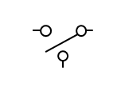

DC-DC 전력 변환 회로
=

---

## 목차

- [선형 레귤레이터](#선형-레귤레이터)
- [스위칭 레귤레이터](#스위칭-레귤레이터)

--- 

## 선형 레귤레이터

원하는 전압 레벨을 얻기 위해서는 전력 변환 회로를 구성해야 합니다.
교류 전압의 경우는 변압기를 이용하면 되지만 직류의 경우는 다릅니다.

### 전압 분배기

가장 단순한 직류 전력 변환 회로입니다.
전압 분배기를 통해 입력 전압을 낮춰서 출력을 얻을 수 있습니다. 다음의 회로를 살펴봅시다.

<figure style="text-align: center;">
  
  <figcaption style="text-align: center; margin-top: 8px; font-size: 0.9em; color: #555;">
    (그림. 전압 분배기)
  </figcaption>
</figure>

위와 같은 회로는 효율이 다음과 같습니다.

$$
\begin{align*}
&P_{in} = v_{in}i_{in} \\
&P_o = v_o i_o \\
&i_{in} = i_o \quad \text{(직렬 연결)} \\
&\eta = \frac{P_o}{P_{in}} = \frac{v_o i_o}{v_{in} i_{in}} = \frac{v_o}{v_{in}}
\end{align*}
$$

이와 같이 두 전압의 비로 나타납니다. 높은 입력 전압으로부터 낮은 출력을 얻는 상황에서는 효율이 저하됩니다.
또한 발열 문제로 인해 냉각 장치가 필요합니다.
이는 전력 변환 장치의 크기와 질량이 더 커지게 되는 문제가 있습니다.

### 선형 레귤레이터

---

## 스위칭 레귤레이터

앞서 언급한 전압 분배기의 여러 문제들로 인해 다른 전력 변환 회로가 필요합니다.

### SPDT 스위치

다음의 스위치를 살펴봅시다.

<figure style="text-align: center;">
  
  <figcaption style="text-align: center; margin-top: 8px; font-size: 0.9em; color: #555;">
    (그림. SPDT 스위치)
  </figcaption>
</figure>

스위치의 극(Pole)이 한개이고, 투(Throw)가 두개인 스위치입니다.
이를 **SPDT (Single Pole Double Throw) 스위치**라고 합니다.

### 전력 변환 원리

다음의 회로를 살펴봅시다.

<figure style="text-align: center;">
  
  <figcaption style="text-align: center; margin-top: 8px; font-size: 0.9em; color: #555;">
    (그림. SPDT 스위치를 통한 전력 변환)
  </figcaption>
</figure>

다음과 같이 스위칭을 한다고 생각해봅시다.

<figure style="text-align: center;">
  
  <figcaption style="text-align: center; margin-top: 8px; font-size: 0.9em; color: #555;">
    (그림. 스위칭 신호)
  </figcaption>
</figure>

스위치의 투를 옮겨가며 전력 공급을 주기적으로 차단할 수 있습니다.
이런 상황에서 전압은 그림과 같이 나타납니다.

<figure style="text-align: center;">
  
  <figcaption style="text-align: center; margin-top: 8px; font-size: 0.9em; color: #555;">
    (그림. 스위치 양단의 전압)
  </figcaption>
</figure>

하지만 전력 변환 장치는 출력이 일정하게 제어돼야 합니다.
따라서 다른 회로를 추가해야 합니다.
이 전압과 같은 펄스 트레인은 주파수 영역에서 다음과 같이 나타납니다.

<figure style="text-align: center;">
  
  <figcaption style="text-align: center; margin-top: 8px; font-size: 0.9em; color: #555;">
    (그림. 주파수 영역에서의 펄스 트레인)
  </figcaption>
</figure>

다양한 주파수 성분이 포함되어 있습니다.
여기서 일정한 출력을 얻으면서 고주파 노이즈를 제거하기 위해 저역 필터를 추가할 수 있습니다.
저역 필터를 거친 출력 전압은 다음과 같이 나타납니다.

<figure style="text-align: center;">
  
  <figcaption style="text-align: center; margin-top: 8px; font-size: 0.9em; color: #555;">
    (그림. 저역 필터를 거친 출력 전압)
  </figcaption>
</figure>

이 SPDT 스위치와 저역 필터가 전력 변환 장치의 기본적인 구성입니다.

### 스위칭 파워-폴

여기서 문제가 하나 있습니다.
SPDT 스위치같은 기계적인 스위치는 스위칭 주파수를 높게 설정할 수 없습니다.
전력 변환 장치의 스위칭 주파수는 기본적으로 수십 $$\text{kHz}$$이고, $$\text{MHz}$$나 $$\text{GHz}$$ 단위까지 갈 수 있습니다.
따라서 전기적인 스위치를 구성해야 합니다.
이는 스위치를 키는 타이밍에 맞춰 구동할 수 있는 능동 소자를 이용하면 됩니다.
대표적으로 트랜지스터가 있습니다.
다음과 같은 회로를 생각해봅시다.

트랜지스터를 구동하면, 부하로 전력이 전달됩니다.
하지만 트랜지스터가 꺼지면 인덕터에 저장된 에너지가 방출될 경로가 없습니다.
이런 상황에서 트랜지스터가 켜지고 꺼지기를 반복한다면, 인덕터 전류가 급격하게 변할 때마다 전압 스파이크가 생성되어 스위치가 고장날 수 있습니다.
그러므로 트랜지스터가 도통될 때 개방되고, 트랜지스터가 꺼졌을 때 인덕터에 저장된 에너지를 방출할 경로가 필요합니다.
이는 다이오드를 이용하면 됩니다.
다음과 같이 회로를 구성해봅시다.

트랜지스터를 구동하면, 다이오드에 역 바이어스가 걸려서 다이오드쪽으로 전류가 흐르지 않습니다.
트랜지스터가 꺼지면, 다이오드에 정 바이어스가 걸리면서 전류가 흐릅니다.
우리가 원하는 방식으로 동작하는 회로입니다.
이 다이오드를 **환류 다이오드(Freewheeling Diode)**라고 하며, 이 전력 변환 회로를 **스위칭 파워-폴(Switching Power-Pole)**이라고 합니다.
DC-DC 컨버터의 기본이 되는 회로입니다.

출력단 전류를 독립 전류원으로 모델링한 이유가 있습니다.
실제로는 스위칭이 즉각적으로 되지 않고, 약간의 [시간](./PowerMOSFET.md#스위칭)이 필요합니다.
보통 $$\text{ns}$$ 정도의 스케일입니다.
그리고 스위칭 주파수는 수십-수백 $$\text{kHz}$$ 정도의 스케일이며, 주기로 생각해보면 $$\mu\text{s}$$ 정도의 스케일입니다.
스위칭 시간이 스위칭 주기에 비해 매우 짧습니다.
그리고 인덕터 전류는 연속적입니다.
스위칭 시간 동안 인덕터 전류가 급격하게 바뀌지 않습니다.
따라서 출력단 전류를 독립 전류원으로 모델링해도 큰 문제가 없습니다.

---

