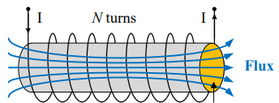

전동기의 기초
=

---

## 목차

---

## 전동기

**전동기(Motor)**는 전기 에너지를 역학적 에너지로 변환하는 장치입니다.
주로 전류를 흘려서 회전 운동 에너지로 변환합니다.
전동기의 원리를 공부하기 위해서는 기초적인 전자기학 및 회전 운동에 대해 공부할 필요가 있습니다.

---

## 기초 전자기 이론

전동기 공부에 필요한 기초 전자기학을 먼저 살펴봅시다.

### 자속

그림과 같이 솔레노이드에 전류를 흘린다고 생각해봅시다.

<figure style="text-align: center;">
  
  <figcaption style="text-align: center; margin-top: 8px; font-size: 0.9em; color: #555;">
    (그림. 솔레노이드)
  </figcaption>
</figure>

솔레노이드의 단면은 다음과 같이 나타낼 수 있습니다.

<figure style="text-align: center;">
  
  <figcaption style="text-align: center; margin-top: 8px; font-size: 0.9em; color: #555;">
    (그림. 솔레노이드의 단면)
  </figcaption>
</figure>

직사각형 형태의 단면 $$S$$를 생각해봅시다.

<figure style="text-align: center;">
  
  <figcaption style="text-align: center; margin-top: 8px; font-size: 0.9em; color: #555;">
    (그림. 단면 S를 고려한 솔레노이드의 단면)
  </figcaption>
</figure>

이 단면 $$S$$에 대해 암페어 법칙을 적용하면 다음과 같습니다.

$$
\oint_{\partial S} \mathbf{B}\cdot d\mathbf{l}=\mu\int_S \mathbf{J}\cdot d\mathbf{a}
$$

솔레노이드 외부 자기장은 $$\mathbf{0}$$이고, 내부에서 세로 경로는 자기장과의 내적이 $$0$$이므로 다음과 같습니다.

$$
\begin{align*}
	&Bl=\mu NI\\
	&\rightarrow B=\frac{\mu NI}{l}
\end{align*}
$$

이제 다음과 같은 단면 $$A$$를 고려해봅시다.

<figure style="text-align: center;">
  
  <figcaption style="text-align: center; margin-top: 8px; font-size: 0.9em; color: #555;">
    (그림. 단면 A를 고려한 솔레노이드)
  </figcaption>
</figure>

단면 $$A$$를 통과하는 **자속(Magnetic Flux 또는 Flux)**은 다음과 같이 나타낼 수 있습니다.

$$
\begin{align*}
	\Phi&=\int_A \mathbf{B}\cdot d\mathbf{a}\\
	&=BA\\
	&=\frac{\mu NA}{l}I
\end{align*}
$$

자속은 특정 단면을 통과하는 자기장선의 양을 의미합니다.
솔레노이드 전체를 통과하는 자기장선의 양은 **쇄교 자속(Flux Linkage)**라고 하며 다음과 같습니다.

$$
\Lambda=N\Phi
$$

$$1$$ 턴 당 통과하는 자속이 있고, 솔레노이드는 총 $$N$$ 턴 감겨있으므로 자속에 $$N$$을 곱하면 쇄교 자속이 됩니다.

### 인덕턴스

**인덕턴스(Inductance)**는 인덕터에 흐르는 단위 전류 당 생성되는 쇄교 자속의 양을 의미합니다.

$$
L=\frac{\Lambda}{I}
$$

자기장으로부터 인덕턴스를 유도해봅시다.
먼저 암페어 법칙을 다시 살펴봅시다.

$$
\oint_{\partial S} \mathbf{H}\cdot d\mathbf{l}=\int_S \mathbf{J}\cdot d\mathbf{a}
$$

선형 매질에 대해 다음이 성립합니다.

$$
\mathbf{B}=\mu\mathbf{H}
$$

따라서 다음과 같이 쓸 수 있습니다.

$$
\oint_{\partial S} \mathbf{B}\cdot d\mathbf{l}=\mu\int_S \mathbf{J}\cdot d\mathbf{a}
$$

계산 결과는 다음과 같았습니다.

$$
B=\frac{\mu NI}{l}
$$

자속은 다음과 같습니다.

$$
\begin{align*}
	\Phi&=\int_A \mathbf{B}\cdot d\mathbf{a}\\
	&=BA
\end{align*}
$$

쇄교 자속은 다음과 같습니다.

$$
\Lambda=N\Phi
$$

인덕턴스는 다음과 같습니다.

$$
\begin{align*}
	L&=\frac{\Lambda}{I}\\
	&=\frac{\mu N^2A}{l}
\end{align*}
$$

### 투자율

**투자율(Permeability)**은 매질이 외부 자기장에 대해 자화되는 정도를 나타내는 양입니다.
진공의 투자율은 다음과 같습니다.

$$
\mu_0=4\pi\times10^{-7}\ \text{H/m}
$$

매질의 투자율에 대한 진공의 투자율을 **상대 투자율(Relative Permeability)**라고 하며 다음과 같이 나타냅니다.

$$
\mu_r=\frac{\mu}{\mu_0}
$$

선형 매질은 다음과 같이 자기장과 자속 밀도가 비례합니다.

$$
\mathbf{B}=\mu\mathbf{H}
$$

투자율의 값에 따라 물성(강자성, 상자성, 반자성)이 다릅니다.
또한 전자기파 이론에서는 복소 투자율을 다룹니다.

### 자기 포화

일반적으로 인덕터에 흐르는 전류와 자속은 다음의 관계에 있습니다.

<figure style="text-align: center;">
  
  <figcaption style="text-align: center; margin-top: 8px; font-size: 0.9em; color: #555;">
    (그림. 인덕터 전류와 자속의 관계)
  </figcaption>
</figure>

소전류 영역에서는 자속이 선형적으로 증가합니다.
이 구간을 **선형 영역(Linear Region)**이라고 합니다.
특정 구간부터 증가율이 줄어듭니다.
이 지점을 **무릎 점(Knee Point)**이라고 합니다.
그 이후부터는 자속이 거의 일정합니다.
이 구간을 **포화 영역(Saturation Region)**이라고 합니다.
포화 영역에서는 인덕터가 더 이상 제 기능을 하지 못합니다.
인덕터 설계 시에 반드시 고려해야 합니다.

전동기의 토크는 생성된 자속에 비례합니다.
따라서 많은 양의 자속이 필요합니다.
이에 따라 동작점을 무릎 점 또는 약간 포화된 지점에 선정합니다.
